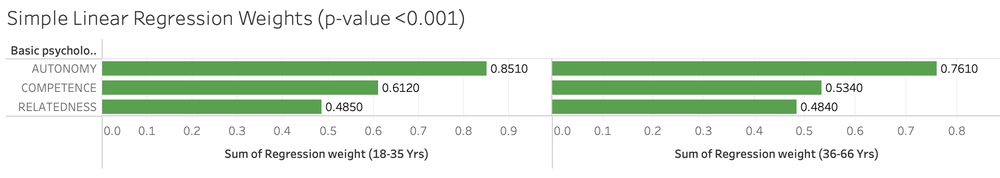

# Basic Psychological Need Satisfaction and Work Satisfaction
📊 Analysis Summary
This cross-sectional study aims to investigate whether basic psychological need satisfaction is comparably associated with work satisfaction in different ages, through the lens of Self-determination Theory. Blue-collar workers in Sweden (N = 602, 69% men), aged 19-66 completed the Need Satisfaction, and a subset of the second version of the Copenhagen Psychosocial Questionnaire. Structural equitation modeling (SEM) was used to test if age moderates the association between basic psychological need satisfaction and work satisfaction.

 **Key Findings:**
- The regression model explained 68% of the variance in work satisfaction.
- The model achieved an R² score of 0.68, indicating a strong predictive capability.
- Variables included in the final model were Autonomy need satisfaction (AUT), Competence need satisfaction (COM) and Relatedness need satisfaction (REL).
- Although AUT, COM, and REL each had positive associations with work satisfaction in simple linear regressions, only AUT had a significant association with work satisfaction when the 
  other variables were controlled for. This means the most important predictor of work satisfaction is AUT.
  
  
](https://github.com/MbaliMabaso/Basic_Pychological_Need_Satisfaction_And_Work_Satisfaction/blob/a4c52e73d7f83a2ab424d8c0ae28d06380963d0e/SimpleLinearRegression.png)
]([https://github.com/MbaliMabaso/Basic_Pychological_Need_Satisfaction_And_Work_Satisfaction/blob/470a52d486555374f452963eeeb7e5ce36e655ef/MultipleLinearRegression.png](https://github.com/MbaliMabaso/Basic_Pychological_Need_Satisfaction_And_Work_Satisfaction/blob/151d771171eecf202a7f3028f509ae7bd5cd7174/MultipleRegression.png))
- Age did not moderate the association between the satisfaction of basic psychological needs and work satisfaction.
  ](https://github.com/MbaliMabaso/Basic_Pychological_Need_Satisfaction_And_Work_Satisfaction/blob/ccfc28282982c9400037bda26fe4191149eb6f86/ModerationTest.png)
 
For more information regarding the analysis, see the REPORT.md file. 'Basic_Psychological_Need_Satisfaction_And_Work_Satisfaction`.

