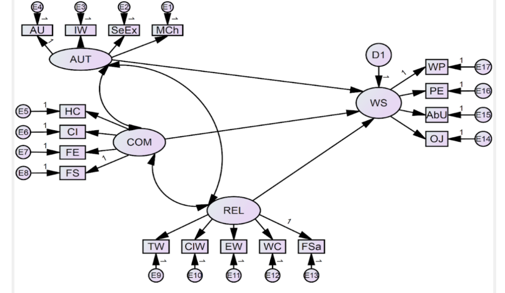

1️⃣ Overview
This project is based on my Master's thesis, which explored the predictors of **work satisfaction** using **Self-Determination Theory (SDT)**. The study involved **survey validation** through **Confirmatory Factor Analysis (CFA)** and **structural equation modeling**, achieving **68% variance explained** in work satisfaction.

2️⃣ Research Question
How do **autonomy, competence, and relatedness**—core components of SDT—predict work satisfaction?

3️⃣ Dataset
- **Source:** Survey data collected for my Master's thesis
- **Sample Size:** [(N = 602, 69% men), aged 19-66]
- **Variables:** Work satisfaction, autonomy, competence, relatedness.

  4️⃣  Methodology
1. **Survey Validation with CFA**
   - Used IBM Amos  to test the **construct validity** of survey items
   - Established **configural and metric invariance**
   ](https://github.com/MbaliMabaso/Basic_Pychological_Need_Satisfaction_And_Work_Satisfaction/blob/07c18fb8068b2cf72d4effb440af35a06bfb4b5a/Confirmatory%20factor%20analysis%20and%20Invariance%20testing.png)
       
2. **Structural Equation Modeling**
   - Examined the relationship between SDT variables and work satisfaction

  
  
  
3. **Comparison to a Non-Validated Approach (please see Work-Satisfaction-Analysis)*
   - Highlighted the impact of **survey quality** on model accuracy
   - Demonstrated the importance of **validating survey instruments** in predictive modeling

5️⃣  Results
- **The biggest predictor of work satisfaction among blue-collar workers was autonomy need satisfaction, and age did not moderate the association between basic psychological need satisfaction and work satisfaction.
- **Validated Model (Master’s Thesis):** 68% variance explained
- **Non-Validated Model (please see Work-Satisfaction-Analysis):** 23% variance explained
- **Key Finding:** Survey validation significantly improves the **reliability and explanatory power** of predictive models

  6️⃣ Tools & Technologies
- IBM Amos and SPSS
- Tableau (for data visualization)
- Confirmatory Factor Analysis (CFA)
- Structural equation modeling
- Regression Analysis

  7️⃣ Key Takeaways
✅ **Regarding the outcome of work satisfaction, this study suggests that job designers should mainly focus on creating opportunities that foster feelings of
autonomy in employees.
✅ **An important implication for job design is that employees should create a work environment in which younger and older employees are
treated equally when satisfying basic psychological needs.
✅ **Survey validation improves model accuracy**
✅ **Theoretical frameworks enhance predictive power**
✅ **Data science in organizational psychology can provide actionable insights**

## Citation
If using insights from this research, please cite:
> [Mbali Mabaso], *Basic Psychological Need Satisfaction and Work Satisfaction
across ages: A Lifespan and Self-determination Perspective*, Master's Thesis, [University of Gothenburg], [2023]. Available upon request.

